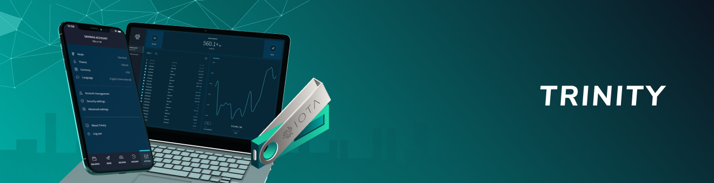
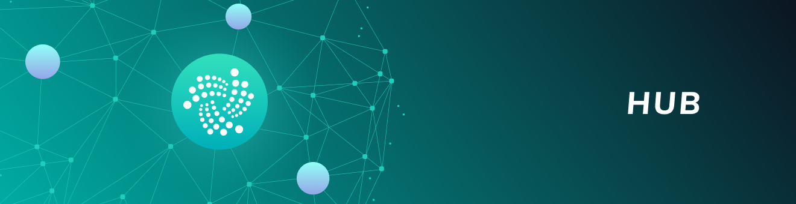

# ウォレット
<!-- # Wallets -->

**ウォレットはシードを保存し，データベースにトランザクションの記録を保存するアプリケーションです．ウォレットを使用すると，シードの保護，トランザクションの送信，および残高の管理のプロセスを簡素化できます．**
<!-- **A wallet is an application that stores your seed and keeps a record of transactions in a database. You can use wallets to simplify the process of securing your seed, sending transactions, and managing your balance.** -->

-------------------------

## [トリニティ](../trinity/introduction/overview.md)
トリニティは，データと IOTA トークンを転送できるユーザーインターフェイスを備えた IOTA の公式ウォレットです．
-------------------------

-------------------------

## [ハブ](../hub/introduction/overview.md)
ハブは，暗号資産交換所用のウォレット管理システムであり，ユーザーの IOTA トークンのデポジットと取り出しを安全に管理できます．
-------------------------
