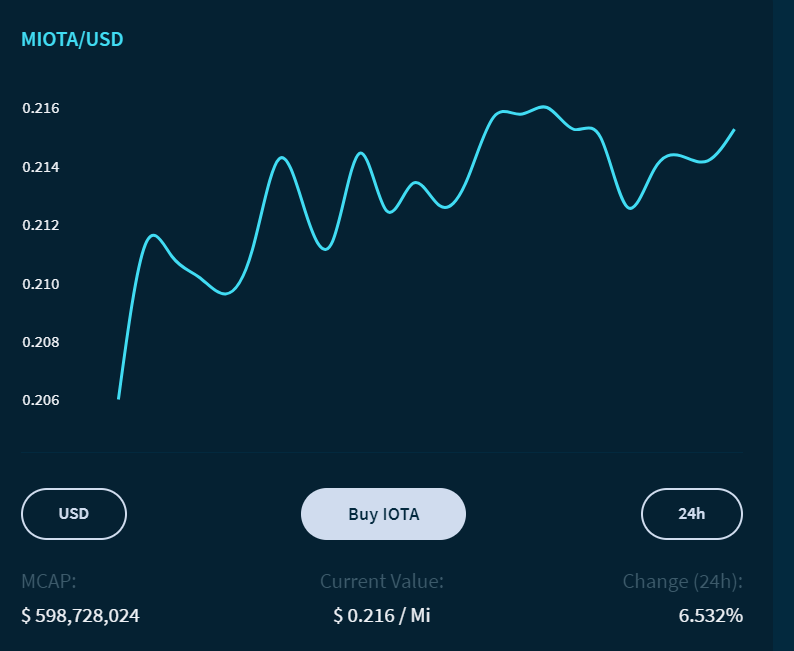
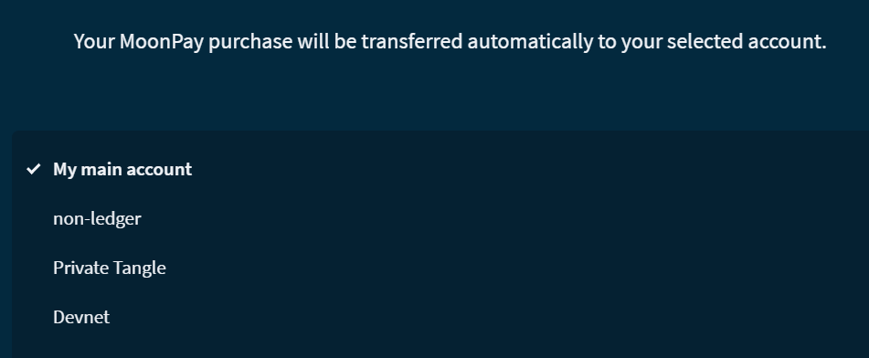

# トリニティで IOTA トークンを購入する
<!-- # Buy IOTA tokens in Trinity -->

**このガイドでは，MoonPay と呼ばれるサードパーティプロバイダーを介してトリニティで [IOTA トークン](root://getting-started/0.1/clients/token.md)を購入する方法を学習します．**
<!-- **In this guide, you learn how to buy [IOTA tokens](root://getting-started/0.1/clients/token.md) in Trinity through a third-party provider called MoonPay.** -->

## 前提条件
<!-- ## Prerequisites -->

このガイドを完了するには，MoonPay Web サイトにリストされている[基準](https://help.moonpay.io/en/articles/2509629-can-anyone-use-this-service)を満たす必要があります．
<!-- To complete this guide, you need to meet the [criteria](https://help.moonpay.io/en/articles/2509629-can-anyone-use-this-service) listed on the MoonPay website. -->

---

1. [**IOTA を購入する**]をクリックし，IOTA トークンを送信するアカウントを選択します
  <!-- 1. Click **Buy IOTA** and select the account to which you want your IOTA tokens to be sent -->

    

2. 画面上の指示に従います．
  <!-- 2. Follow the on-screen instructions -->

    有効なメールアドレスを入力してください．MoonPay はこのメールアドレスを使用して確認コードを送信します．
    <!-- Make sure that you enter a valid email address. MoonPay uses this email address to send you a verification code. -->

    :::info:
    トリニティはお客様の個人データを保存しません．
    :::
    <!-- :::info: -->
    <!-- Trinity does not store any of your personal data. -->
    <!-- ::: -->

3. 支払いが完了したら，ホームページの**購入**タブで購入のステータスを確認します．
<!-- 3. After completing the payment, check the status of your purchase in the **Purchases** tab on the home page -->

:::success:
これで IOTA トークンが得られました．IOTA トークンを保持するか，トランザクションで他の人のアドレスに IOTA トークンを送信することができます．
:::
<!-- :::success: -->
<!-- Now you have IOTA tokens, you can either hold onto them, or send them to someone else's address in a transaction. -->
<!-- ::: -->

## 次のステップ
<!-- ## Next steps -->

[トランザクションを送信する](../how-to-guides/send-a-transaction.md)
<!-- [Send a transaction](../how-to-guides/send-a-transaction.md) -->
