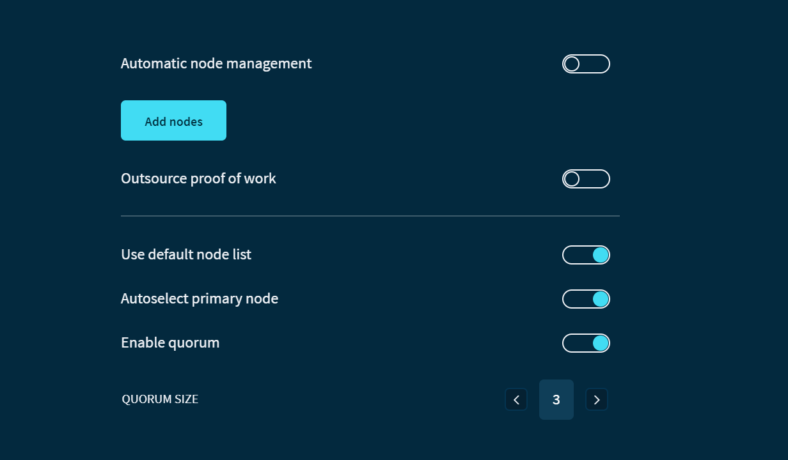

# カスタムノードに接続する
<!-- # Connect to custom nodes -->

**トリニティは、デフォルトノードの[クォーラム](../concepts/node-quorum.md)を介してタングルと対話します。自分自身のノードの1つをクォーラムに追加するか、カスタムノードのクォーラムに接続するか、プルーフオブワークに使用する特定のノードに接続するかを選択できます。**
<!-- **Trinity interacts with the Tangle through a [quorum](../concepts/node-quorum.md) of default nodes. You can choose to add one of your own nodes to the quorum, connect to a quorum of custom nodes, or connect to a specific node to use for proof of work.** -->

:::info:
トリニティのすべてのノードは、HTTPSを介して通信する必要があります。
:::
<!-- :::info: -->
<!-- All nodes in Trinity must communicate over HTTPS. -->
<!-- ::: -->

## トリニティをカスタムノードのクォーラムに接続する
<!-- ## Connect Trinity to a quorum of custom nodes -->

単一のカスタムノードに接続するだけでなく、複数のカスタムノードを追加してそれらをノードクォーラムとして使用することもできます。このようにして、トリニティ内蔵のリモートノードリストを使うことに制限されません。
<!-- As well as connecting to a single custom node, you can also add multiple custom nodes and use them as a node quorum. This way, you aren't restricted to using the built-in remote list of Trinity nodes. -->

1. **設定** > **ノード** > **カスタムノードの追加**に移動し、追加するノードのURLまたはIPアドレスを入力します
  <!-- 1. Go to **Settings** > **Node** > **Add custom nodes**,  and enter the URL or IP address of the nodes you want to add -->

    :::info:
    カスタムノードのクォーラムに接続するには、複数のカスタムノードを追加します。
    :::
    <!-- :::info: -->
    <!-- To connect to a quorum of custom nodes, add more than one. -->
    <!-- ::: -->

2. **自動でノード管理を行う**オプションを無効にします。
  <!-- 2. Disable the **Automatic node management** option -->

3. **主要ノードの自動切替え**オプションを無効にします。
  <!-- 3. Disable the **Primary node autoswitching** option -->

    :::warning:
    このオプションを有効にすると、トリニティは、主要ノードがオフラインになった場合にデフォルトノードの1つに接続できます。

    このオプションを無効にすると、主要ノードがオフラインになった場合、トリニティはどのノードにも接続できなくなります。
    :::
    <!-- :::warning: -->
    <!-- When enabled, this option allows Trinity to connect to one of its defaults nodes if the primary one goes offline. -->

    <!-- By disabling this option, Trinity won't be able to connect to any nodes if the primary node goes offline. -->
    <!-- ::: -->

4. ドロップダウンメニューからカスタムノードを選択します。
  <!-- 4. Select your node from the dropdown menu -->

    :::warning:Devnetノード
    カスタムノードがDevnetノードの場合は、**リモートノードリストを使う**オプションも無効にする必要があります。そのリストのノードはMainnetノードであるため、Devnetと互換性がありません。
    :::
    <!-- :::warning:Devnet nodes -->
    If your custom node is a Devnet node, you must also disable the **Use remote list** option. The nodes in that list are Mainnet nodes, so they're incompatible with the Devnet.
    <!-- ::: -->

5. **保存**をクリックします。
  <!-- 5. Click **Save** -->

:::success:おめでとうございます！:tada:
タングルについてのトリニティが表示するすべての情報は、カスタムノードから送信されました。
:::
<!-- :::success:Congratulations! :tada: -->
<!-- All the information that Trinity displays about the Tangle is now sent from your custom nodes. -->
<!-- ::: -->

## プルーフオブワークを外部委託する
<!-- ## Outsource proof of work -->

トランザクションを送信する前に、[プルーフオブワーク](root://dev-essentials/0.1/concepts/minimum-weight-magnitude.md)を含める必要があります。プルーフオブワークには、エネルギーを使用して計算を行うコンピューターが必要です。デフォルトでは、トリニティを実行しているコンピューターでプルーフオブワークが行われます。
<!-- Before you send a transaction, it must include a [proof of work](root://dev-essentials/0.1/concepts/minimum-weight-magnitude.md). Proof of work requires a computer to use energy to do computations. By default proof of work is done on the computer that is running Trinity. -->

プルーフオブワークの外部委託オプションを使用して、特定のノードにトランザクションのプルーフオブワークを行うように依頼できます。
<!-- You can use the Outsouce proof of work option to ask a specific node to do the proof of work for your transactions -->
