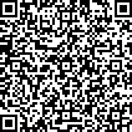

# トリニティが読み取れるQRコードを作成する
<!-- # Create a QR Code that Trinity can read -->

**送信者にアドレスやメッセージなどのトランザクション情報を入力させないようにするには、トランザクションフィールドに自動入力できるQRコードを作成します。このガイドでは、IOTAユーティリティWebサイトを使用してQRコードを作成します。**
<!-- **To avoid making senders enter transaction information such as your address or a message, you can create a QR code that can auto-populate the transaction fields. In this guide, you create a QR code, using the IOTA utility website.** -->

QRコードは、アドレス、金額、およびメッセージの各フィールドに自動入力することで、トリニティでトランザクションを送信するプロセスをスピードアップします。送信者がQRコードをスキャンできるようにすることで、eコマースWebサイトなどの受信者は、顧客が購入を完了するのにかかる時間を短縮できます。
<!-- QR codes speed up the process of sending a transaction in Trinity by auto-populating the Address, Value, and Message fields. By allowing senders to scan a QR code, recipients such as ecommerce websites can reduce the time it takes for customers to complete a purchase. -->

:::info:
トリニティのアドレスに送信するには、9トライトのチェックサムを含める必要があります。トリニティで新しいアドレスを生成した場合、そのアドレスには既にチェックサムが含まれています。
:::
<!-- :::info: -->
<!-- To send to an address in Trinity, it must include the 9-tryte checksum. If you generated a new address in Trinity, that address will already include the checksum. -->
<!-- ::: -->

1. [公式IOTAユーティリティWebサイト](https://utils.iota.org/qr-create)に移動します。
<!-- 1. Go to the [official IOTA utility website](https://utils.iota.org/qr-create) -->
2. フィールドに入力します。
<!-- 2. Complete the fields -->
3. PNGファイルとしてQRコードを保存します。
<!-- 3. Save the QR code as a PNG file -->
4. 送信者にQRコードを送信するか、Webサイトに追加します。
<!-- 4. Send the QR code to your sender, or add it to your website -->

送信者がトリニティでQRコードをスキャンすると、トランザクションフィールドにQRコードの情報が自動的に取り込まれます。
<!-- When the sender scans the QR code in Trinity, the transaction fields will be auto-populated with the ones from the QR code. -->

## 次のステップ
<!-- ## Next steps -->

[IOTAトークンの残高を確認する](../how-to-guides/read-your-balance.md)。
<!-- [Check your balance of IOTA tokens](../how-to-guides/read-your-balance.md). -->
