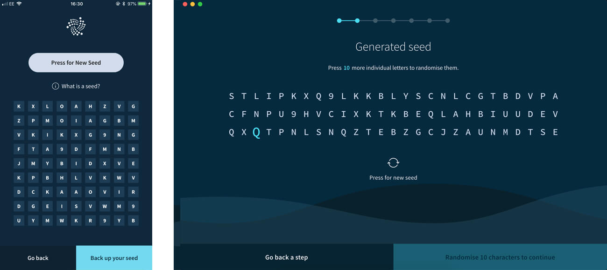
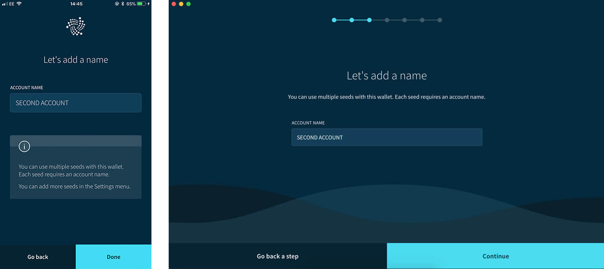

# アカウントを作成する
<!-- # Create an account -->

**トリニティアカウントはパスワードで保護されており，複数の[シード](root://getting-started/0.1/clients/seeds.md)をモバイル端末やコンピュータに安全に保管することができます．このガイドでは，新しいアカウントを作成します．**
<!-- **Trinity accounts are password-protected to secure and store your [seeds](root://getting-started/0.1/clients/seeds.md) on your mobile device or computer. In this guide, you create a new account.** -->

1. [トリニティをダウンロードし](https://trinity.iota.org/)，トリニティを開きます．
<!-- 1. [Download Trinity](https://trinity.iota.org/) and open it -->

2. シードを持っているかどうかを選択します．
<!-- 2. Select whether you have a seed -->

    :::info:
    [ハードウェアウォレット](../concepts/hardware-wallet.md)をお持ちの場合は，ハードウェアウォレットを接続して画面の指示に従います．ハードウェアウォレットを使う場合は，シードをバックアップする必要はありません．
    :::
    <!-- :::info: -->
    <!-- If you have a [hardware wallet](../concepts/hardware-wallet.md), connect it and follow the on-screen instructions. You don't need to back up your seed if you use a hardware wallet. -->
    <!-- ::: -->

    

3. シードのアカウント名を入力します．
  <!-- 3. Enter an account name for your seed -->

    :::info:
    後で[アカウント設定](../how-to-guides/manage-your-account.md)でアカウント名を変更することができます．
    :::
    <!-- :::info: -->
    <!-- You can choose to rename your account later in the [Account management](../how-to-guides/manage-your-account.md). -->
    <!-- ::: -->

    

4. [シードをバックアップする](../how-to-guides/back-up-seed.md)オプションを選択してログインパスワードを入力します．トリニティにログインするたびにこのパスワードが必要になります．
  <!-- 4. Select an option to [back up your seed](../how-to-guides/back-up-seed.md) and enter a login password. You will need this password every time you log into Trinity. -->

:::success:
これでトリニティアカウントができました．これを使用してトランザクションを送受信し，IOTA トークンを購入することもできます．
:::
<!-- :::success: -->
<!-- Now you have a Trinity account, you can use it to send and receive transactions and even buy IOTA tokens. -->
<!-- ::: -->

## 次のステップ
<!-- ## Next steps -->

[アカウントを管理する](../how-to-guides/manage-your-account.md)をご覧ください．
<!-- Learn to [manage your account](../how-to-guides/manage-your-account.md). -->

[生体認証を設定する](../how-to-guides/manage-your-security-settings.md)により，トリニティのモバイル版に追加のアカウントセキュリティを設定します．
<!-- Add extra account security to Trinity mobile by [setting up biometric authentication](../how-to-guides/manage-your-security-settings.md). -->

[IOTA トークンを購入する](../how-to-guides/buy-iota.md)
<!-- [Buy IOTA tokens](../how-to-guides/buy-iota.md). -->

[トランザクションを送信する](../how-to-guides/send-a-transaction.md)
<!-- [Send a transaction](../how-to-guides/send-a-transaction.md). -->
