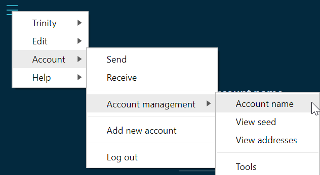
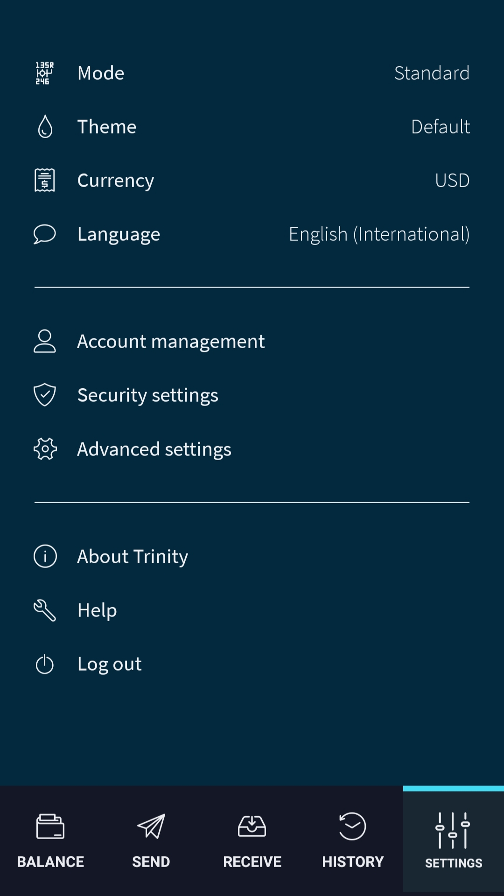

# アカウントを管理する
<!-- # Manage your account -->

**トリニティでは1つ以上のアカウントを持つことができ，それぞれに固有のシードがあります．**
<!-- **Trinity allows you to have more than one account, each of which has a unique seed.** -->

:::danger:
2020年2月11日、IOTA 財団は、一部のユーザーのシードと Trinity パスワードが侵害された Trinity ウォレットに対する攻撃に気付きました。[Trinity アカウントの保護](../how-to-guides/protect-trinity-account.md)に関するアドバイスを確認してください。
:::
<!-- :::danger: -->
<!-- On 11 February 2020, the IOTA Foundation became aware of an attack on the Trinity wallet, during which some users’ seeds and Trinity passwords were compromised. Please check our advice for [protecting your Trinity account](../how-to-guides/protect-trinity-account.md). -->
<!-- ::: -->

アカウントごとに，次のことを実行できます．
<!-- For each of your accounts, you can do the following: -->

- シードにアクセスします（ハードウェアウォレットを使う場合は利用できません）．
<!-- - Access your seed (not available if you use a hardware wallet) -->
- アドレスとその残高を確認します．
<!-- - View your addresses and their available balance -->
- アカウントの名前を変更します．
<!-- - Change the name of an account -->

これらのタスクを実行する前に，管理する正しいアカウントを必ず選択してください．
<!-- Make sure that you select the correct account to manage before completing any of these tasks. -->

--------------------
### デスクトップ
<!-- ### Desktop -->

アカウント設定にアクセスするには，**Trinity** > **設定** > **アカウント設定**に移動します．
<!-- To access Account management, go to **Trinity** > **Settings** > **Account management** -->

---
### モバイル
<!-- ### Mobile -->

アカウント設定にアクセスするには，**設定** > **アカウント設定**に移動します．
<!-- To access Account management, go to **Settings** > **Account management** -->

--------------------

## シードにアクセスする
<!-- ## Access your seed -->

作成したアカウントはそれぞれ異なるシードを使用します．
<!-- Each account that you create uses a different seed. -->

シードにアクセスするには，**アカウント設定**に移動して**シードを表示**をクリックします．
<!-- To access the seed, go to Account management, and click **View seed**. -->

## アドレスを表示する
<!-- ## View your addresses -->

各シードは，ほぼ無制限の数のアドレスを生成するために使用できます．
<!-- Each seed can be used to generate an almost unlimited number of addresses. -->

生成したアドレスを表示するには，**アカウント設定**に移動して**アドレスを表示**をクリックします．
<!-- To view the addresses that you've generated, go to Account management, and click **View addresses**. -->

:::info:
アドレスの中心を通る赤い線は，そのアドレスから IOTA トークンが取り出されたことを意味します．トリニティは使用済みアドレスからIOTAトークンを取り出すことを止めさせます．そしてあなたは[使用済みアドレス](root://getting-started/0.1/clients/addresses.md#spent-addresses)にIOTAトークンを絶対に預け入れてはいけません．
:::
<!-- :::info: -->
<!-- A red line through the center of an address means that the address has been spent. Trinity stops you from withdrawing IOTA tokens from [spent addresses](root://getting-started/0.1/clients/addresses.md#spent-addresses), so you must never deposit IOTA tokens into them. -->
<!-- ::: -->

## アカウント名を変更する
<!-- ## Change your account's name -->

複数のアカウントを管理しやすくするために，それぞれに一意の名前を付けることができます．
<!-- To make it easier to manage multiple accounts, you can give each of them a unique name. -->

アカウント名を変更するには，**アカウント設定**に移動して**アカウント名**をクリックします．
<!-- To change the name of an account, go to Account management, and click **Account name**. -->

## ログインパスワードを変更する
<!-- ## Change your login password -->

トリニティはシードを保存し（[ハードウェアウォレット](../concepts/hardware-wallet.md)を使わない限り），そしてパスワードでログインすることを可能にします．
<!-- Trinity stores your seeds for you (unless you use a [hardware wallet](../concepts/hardware-wallet.md)) and allows you to log in with a password. -->

--------------------
### デスクトップ
<!-- ### Desktop -->

ログインパスワードを変更するには，**Trinity** > **設定** > **パスワード変更**に移動します．
<!-- To change the login password, go to **Trinity** > **Settings** > **Change password** -->

---
### モバイル
<!-- ### Mobile -->

ログインパスワードを変更するには，**設定** > **セキュリティ設定** > **パスワード変更**に移動します．
<!-- To change the login password, go to **Settings** > **Security settings** > **Change password** -->
--------------------

## 次のステップ
<!-- ## Next steps -->

[トランザクションを送信する](../how-to-guides/send-a-transaction.md)．
<!-- [Send a transaction](../how-to-guides/send-a-transaction.md) -->
