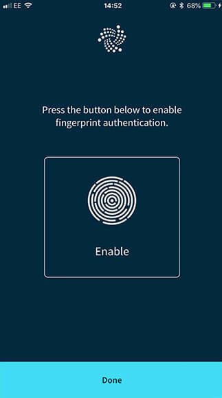

# 生体認証を設定する（モバイル端末のみ）
<!-- # Set up biometric authentication (mobile devices only) -->

**生体認証は、指紋を使用してトリニティにログインできるセキュリティプロセスです。このガイドでは、指紋またはパスワードのいずれかを使用してトリニティにログインする生体認証を設定します。**
**Biometric authentication is a security process that allows you to log into Trinity with your fingerprint. In this guide, you set up biometric authentication so that you have the option to log into Trinity, using either your fingerprint or your password.**

1. Go to **Settings** > **Security settings**

2. **生体認証**をクリックします。
<!-- 2. Click **Biometric authentication** -->

3. **有効**をクリックします。
<!-- 3. Click **Enable** -->

4. **完了**をクリックします。
<!-- 4. Click **Done** -->

:::success:
これで、指紋認証でログインできます。
:::
<!-- :::success: -->
<!-- Now you can log in with your fingerprint. -->
<!-- ::: -->

## 次のステップ
<!-- ## Next steps -->

[IOTAトークンを購入する](../how-to-guides/buy-iota.md)
<!-- [Buy IOTA tokens](../how-to-guides/buy-iota.md). -->

[トランザクションを送信する](../how-to-guides/send-a-transaction.md)
<!-- [Send a transaction](../how-to-guides/send-a-transaction.md). -->
