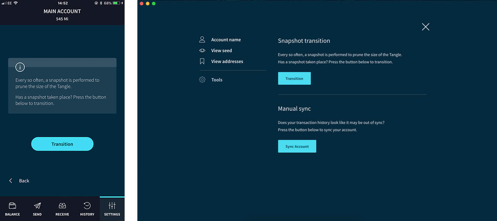

# スナップショット移行を実行する
<!-- # Perform a snapshot transition -->

**グローバルスナップショット中に，ノードは自身の台帳から古いトランザクションデータを削除してメモリを解放します．グローバルスナップショットの後，ノードは少なくとも 1i の残高を持つアドレスのみを保持します．グローバルスナップショットの後に正しい残高が表示されない場合は，トリニティが最新の残高をリクエストできるように，スナップショット移行を実行する必要があります．**
<!-- **During a global snapshot, nodes remove old transaction data from their ledgers to free memory. After a global snapshot, nodes have only the addresses with a balance of at least 1 i. If you don't see your correct balance after a global snapshot, you must perform a snapshot transition to allow Trinity to request the latest balance of your addresses.** -->

:::danger:
2020年2月11日、IOTA 財団は、一部のユーザーのシードと Trinity パスワードが侵害された Trinity ウォレットに対する攻撃に気付きました。[Trinity アカウントの保護](../how-to-guides/protect-trinity-account.md)に関するアドバイスを確認してください。
:::
<!-- :::danger: -->
<!-- On 11 February 2020, the IOTA Foundation became aware of an attack on the Trinity wallet, during which some users’ seeds and Trinity passwords were compromised. Please check our advice for [protecting your Trinity account](../how-to-guides/protect-trinity-account.md). -->
<!-- ::: -->

:::info:
トリニティはステートフルです．つまり，トランザクション履歴のローカルコピーをデバイスに保存するということです．その結果，グローバルスナップショット後もトランザクション履歴を見ることができます．
:::
<!-- :::info: -->
<!-- Trinity is stateful, which means that it stores a local copy of your transaction history on your device. As a result, you can still see your transaction history after a global snapshot. -->
<!-- ::: -->

--------------------
### デスクトップ
<!-- ### Desktop -->

1. **アカウント** > **アカウント設定** > **ツール** に移動します．
<!-- 1. Go to **Account** > **Account management** > **Tools** -->

2. **トランザクション** をクリックします．
<!-- 2. Click **Transition** -->
---
### モバイル
<!-- ### Mobile -->

1. **設定** > **アカウント設定** に移動します．
<!-- 1. Go to **Settings** > **Account management** -->

2. **トランザクション** をクリックします．
2. Click **Transition**
--------------------

:::success:
正しい残高が表示されるはずです。
:::
<!-- :::success: -->
<!-- You should see your correct balance. -->
<!-- ::: -->

