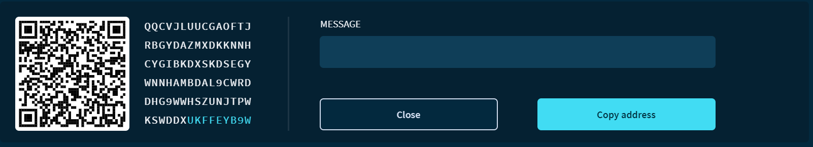

# トランザクションを受信する
<!-- # Receive a transaction -->

**トランザクションを受信するには，新しい[アドレス](root://getting-started/0.1/clients/addresses.md)を生成して送信者に渡す必要があります．このガイドでは，トリニティで新しいアドレスを生成し，送信者に提供する形式を検討します．**
<!-- **To receive a transaction, you need to generate a new [address](root://getting-started/0.1/clients/addresses.md) and give it to the sender. In this guide, you generate a new address in Trinity and consider in which format to give it to the sender.** -->

:::danger:
2020年2月11日、IOTA 財団は、一部のユーザーのシードと Trinity パスワードが侵害された Trinity ウォレットに対する攻撃に気付きました。[Trinity アカウントの保護](../how-to-guides/protect-trinity-account.md)に関するアドバイスを確認してください。
:::
<!-- :::danger: -->
<!-- On 11 February 2020, the IOTA Foundation became aware of an attack on the Trinity wallet, during which some users’ seeds and Trinity passwords were compromised. Please check our advice for [protecting your Trinity account](../how-to-guides/protect-trinity-account.md). -->
<!-- ::: -->

1. **受取**をクリックします．
<!-- 1. Click **Receive** -->

2. [**アドレスを生成**]をクリックして，新しいアドレスを生成します．
<!-- 2. Click **Generate address** to generate a new address -->

3. アドレスをコピーして送信者に渡すか，[QR コードを作成する](../how-to-guides/create-a-qr-code.md)か，または[ディープリンクを作成します](../how-to-guides/create-deep-link.md)．
  <!-- 3. Either copy the address and give it to the sender, [create a QR code](../how-to-guides/create-a-qr-code.md), or [create a deep link](../how-to-guides/create-deep-link.md). -->

    :::danger:重要！
    Android デバイスでは，どのアプリケーションでもキーボードの押下の内容を読み取り，変更することができます．アドレスをトリニティに貼り付けるときは注意して，貼り付けたアドレスがコピーしたものと同じであることを確認してください．
    :::
    <!-- :::danger:Important -->
    <!-- On Android devices, any application can read the content of keyboard presses and modify it. Be careful when pasting an address into another app and make sure that the address you have pasted is the same one that you copied. -->
    <!-- ::: -->

    

4. トランザクションを受信または送信すると，トランザクションがホームページに表示されます．一覧からトランザクションをクリックして，トランザクションに関する情報を表示できます．
  <!-- 4. When you either receive or send a transaction, it appears on the home page. Click a transaction from the list to view information about it. -->

    

    :::info:
    アドレスフィールドは，[上級モード](../how-to-guides/change-the-general-settings.md)でのみ表示されます．
    :::
    <!-- :::info: -->
    <!-- The Addresses field is displayed only in [Advanced mode](../how-to-guides/change-the-general-settings.md). -->
    <!-- ::: -->

:::success:
これで，他の人があなたにトランザクションを送信できるように，他の人に自分のアドレスを与える方法がわかりました．
:::
<!-- :::success: -->
<!-- Now you know how to give others your addresses so they can send you transactions. -->
<!-- ::: -->

## 次のステップ
<!-- ## Next steps -->

[カスタムノードに接続する](../how-to-guides/connect-to-a-custom-node.md)
<!-- [Connect to a custom node](../how-to-guides/connect-to-a-custom-node.md). -->
