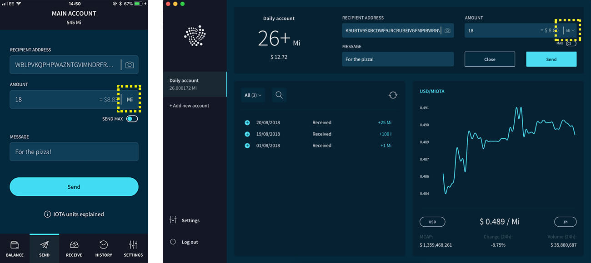
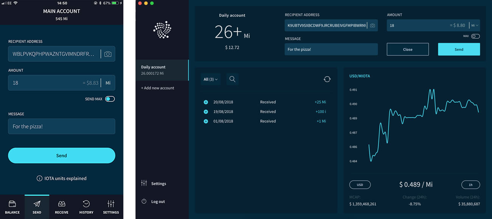
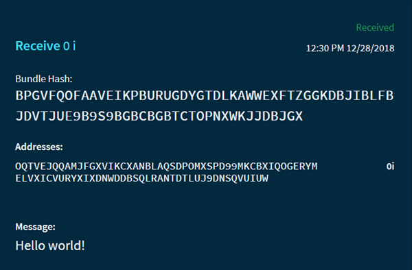

# トランザクションを送信する
<!-- # Send a transaction -->

**トリニティでは、[アドレス](root://getting-started/0.1/clients/addresses.md)、メッセージ、または[IOTAトークン](root://getting-started/0.1/clients/token.md)の量を入力することにより、[ノード](root://getting-started/0.1/network/nodes.md)にトランザクションを送信できます。このガイドでは、トリニティでトランザクションを送信する方法を学習します。**
<!-- **In Trinity, you can send a transaction to a [node](root://getting-started/0.1/network/nodes.md) by entering an [address](root://getting-started/0.1/clients/addresses.md), a message, and/or an amount of [IOTA tokens](root://getting-started/0.1/clients/token.md). In this guide, you learn how to send a transaction in Trinity.** -->

## 手順1. IOTAネットワークを選択する
<!-- ## Step 1. Choose an IOTA network -->

任意の[IOTAネットワーク](root://getting-started/0.1/network/iota-networks.md)上のノードにトランザクションを送信できます。
<!-- You can send transaction to a node on any [IOTA network](root://getting-started/0.1/network/iota-networks.md). -->

デフォルトでは、トリニティはIOTAトークンが価値を持つメインIOTAネットワークを維持するMainnetノードの[クォーラム](../concepts/node-quorum.md)に接続します。
<!-- By default, Trinity connects to a [quorum](../concepts/node-quorum.md) of Mainnet nodes, which maintain the main IOTA network where IOTA tokens have a value. -->

IOTAをテストしている場合は、[Devnetノードに接続する](../how-to-guides/connect-to-a-custom-node.md)ことができます。
<!-- If you're testing IOTA, you may want to [connect to a Devnet node](../how-to-guides/connect-to-a-custom-node.md). -->

## 手順2. トランザクションを送信する
<!-- ## Step 2. Send a transaction -->

選択したIOTAネットワーク上のノードに接続したら、トランザクションを送信できます。
<!-- When you're connected to a node on your chosen IOTA network, you can send it a transaction. -->

1. **送信**をクリックします。
<!-- 1. Click **Send** -->

2. 受取人のアドレスを入力します。
  <!-- 2. Enter a recipient's address -->

    :::danger:重要！
    Androidデバイスでは、アプリケーションはキーボードの押下の内容を読み取って変更できます。トリニティにアドレスをペーストときは注意してください。チェックサムを使用して、ペーストしたアドレスがコピーしたものと同じであることを確認してください。
    :::
    <!-- :::danger:Important -->
    <!-- On Android devices, applications can read and modify keyboard presses. Be careful when pasting an address into Trinity and use the checksum to make sure that the address you have pasted is the same one that you copied. -->
    <!-- ::: -->

3. メッセージまたは一定量のIOTAトークン、あるいはその両方を入力します。
  <!-- 3. Enter either a message, or an amount of IOTA tokens, or both -->

    :::info:
    送金する金額は、[IOTAトークンの単位](root://getting-started/0.1/clients/token.md#units-of-iota-tokens)または[選択した通貨](../how-to-guides/change-the-general-settings.md)で入力できます。送信する金額に注意してください。
    :::
    <!-- :::info: -->
    <!-- The amount to send can be entered in [units of IOTA tokens](root://getting-started/0.1/clients/token.md#units-of-iota-tokens) or in the [currency of your choice](../how-to-guides/change-the-general-settings.md). Pay close attention to the amount that you're sending. -->
    <!-- ::: -->

    :::info:
    アカウントがハードウェアウォレットにリンクされている場合、IOTAトークンまたはメッセージのいずれかを送信できますが、両方は送信できません。
    :::
    <!-- :::info: -->
    <!-- If your account is linked to a hardware wallet, you can send either IOTA tokens or a message, but not both. -->
    <!-- ::: -->

    

4. **送金**をクリックします。
  <!-- 4. Click **Send** -->

    

    :::info:
    トリニティモバイルを最小化すると、送信プロセスはアプリを再開するまで一時停止します。
    :::
    <!-- :::info: -->
    <!-- If you minimize Trinity Mobile, the sending process pauses until you reopen it. -->
    <!-- ::: -->

送信されたトランザクションはトランザクション履歴に保存され、そこでステータスなどの情報を確認できます。
<!-- Sent transactions are saved in the transaction history, where you can see information such as their status. -->

:::info:
アドレスフィールドは、[上級モード](../how-to-guides/change-the-general-settings.md)でのみ表示されます。
:::
<!-- :::info: -->
<!-- The Addresses field is displayed only in [Advanced mode](../how-to-guides/change-the-general-settings.md). -->
<!-- ::: -->

## 次のステップ
<!-- ## Next steps -->

[残高を読む](../how-to-guides/read-your-balance.md)。
<!-- [Read you balance](../how-to-guides/read-your-balance.md). -->

[トランザクションを受信する](../how-to-guides/receive-a-transaction.md)。
<!-- [Receive a transaction](../how-to-guides/receive-a-transaction.md). -->
