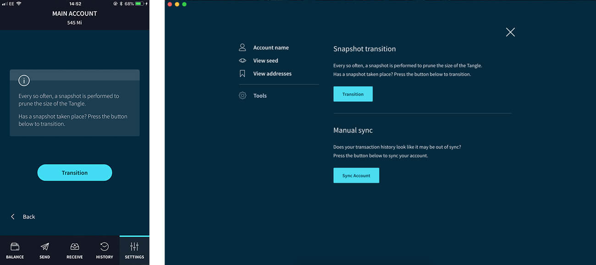

# トラブルシューティング
<!-- # Troubleshooting -->

**このリファレンスガイドを使用して，トリニティに関連する問題を解決してください．**
<!-- **Use this reference guide to resolve issues related to Trinity.** -->

問題の解決策が見つからない場合は，公式IOTA [Discord](https://discord.iota.org/) の`ヘルプ`チャンネルでトリニティチームに連絡してください．
<!-- If you can't find the solution to your issue, reach out to the Trinity team on the `help` channel of the official IOTA [Discord](https://discord.iota.org/). -->

## 不正確な残高
<!-- ## Incorrect balance -->

トリニティは，[ノード](root://getting-started/0.1/network/nodes.md)に[シード](root://getting-started/0.1/clients/seeds.md)に関連付けられているすべての[アドレス](root://getting-started/0.1/clients/addresses.md)の残高を要求することにより，定期的に残高を更新します．
<!-- Trinity regularly updates your balance by asking [nodes](root://getting-started/0.1/network/nodes.md) for the balance of all [addresses](root://getting-started/0.1/clients/addresses.md) associated with your [seed](root://getting-started/0.1/clients/seeds.md). -->

合計残高はホームページの上部に表示されます．[個々のアドレスの残高を表示](../how-to-guides/manage-your-account.md#view-the-addresses-of-an-account)することもできます．
<!-- Your total balance is displayed at the top of the home page. You can also [view the balance of individual addresses](../how-to-guides/manage-your-account.md#view-the-addresses-of-an-account). -->

トリニティがノードに接続できない場合，不正確な残高が表示される場合があります．
<!-- If Trinity can't connect to a node, it may display an incorrect balance. -->

この問題を解決するために，トリニティは生成されたアドレスのリストを保持して，トリニティが次にノードに接続したときに再同期できるようにします．
<!-- To fix this problem, Trinity keeps a list of your generated addresses so that you can re-synchronize it the next time Trinity connects to a node. -->

残高が間違っていて，かつグローバルスナップショットが発生していないと思われる場合は，**設定** > **アカウント** > **アカウント管理** > **ツール** > **アカウントを同期**に移動して，トリニティを同期できます ．
<!-- If you think your balance is wrong and a global snapshot hasn't occurred), you can synchronize Trinity by going to **Settings** > **Account** > **Account management** > **Tools** > **Sync account**. -->

### グローバルスナップショット
<!-- ### Global snapshots -->

グローバルスナップショット中に，ノードは古いトランザクションデータを台帳から削除してメモリを解放します．グローバルスナップショットの後，ノードは少なくとも 1i の残高のアドレスのみを持ちます．グローバルスナップショットの後に正しい残高が表示されない場合は，スナップショットの移行を実行して，トリニティがアドレスの最新の残高をリクエストできるようにする必要があります．
<!-- During a global snapshot, nodes remove old transaction data from their ledgers to free memory. After a global snapshot, nodes have only the addresses with a balance of at least 1 i. If you don't see your correct balance after a global snapshot, you must perform a snapshot transition to allow Trinity to request the latest balance of your addresses. -->

:::info:
トリニティはステートフルです．つまり，トランザクション履歴のローカルコピーがデバイスに保存されます．その結果，グローバルスナップショットの後でもトランザクション履歴を表示できます．
:::
<!-- :::info: -->
<!-- Trinity is stateful, which means that it stores a local copy of your transaction history on your device. As a result, you can still see your transaction history after a global snapshot. -->
<!-- ::: -->

1. **アカウント管理** > **ツール** > **移行** に移動します．
<!-- 1. Go to Account management > **Tools** > **Transition** -->

## ペンディングトランザクション
<!-- ## Pending transaction -->

[タングル](root://getting-started/0.1/network/the-tangle.md)のトランザクションが長時間ペンディングになっている場合，[自動プロモート設定](../how-to-guides/auto-promote.md)が**有効**に設定されていることを確認してください．
<!-- If a transaction on the [Tangle](root://getting-started/0.1/network/the-tangle.md) is pending for a long time, make sure that the [Auto-promotion setting](../how-to-guides/auto-promote.md) is set to **Enabled**. -->

:::info:
自動プロモートは，モバイル端末では，トリニティが前面に表示されている場合にのみ利用できます．
:::
<!-- :::info: -->
<!-- Auto-promotion is available on mobile devices only when Trinity is in the foreground. -->
<!-- ::: -->

## トランザクションを送信できません
<!-- ## Unable to send a transaction -->

以下のいずれかの理由により，トリニティはトランザクションを送信するのを阻止することがあります．
<!-- Trinity may stop you from sending a transaction for any of the following reasons: -->

- [使用済みアドレス](root://getting-started/0.1/clients/addresses.md#spent-addresses)に資金がある場合，トリニティは IOTA トークンを保護するためにそのアドレスからの取り出しを停止します．
<!-- - If you have funds on a [spent address], Trinity stops you withdrawing from that address to protect your IOTA tokens. -->
- 送信先のアドレスが使用済みアドレスの場合，トリニティはそのアドレスへの送信を停止して，IOTA トークンを保護します．この場合，受信者に新しいアドレスを尋ねてください．
<!-- - If the address you are sending to is spent, Trinity will stop you from sending to that address to protect your IOTA tokens. In this case, ask the recipient for a new address. -->
- 複数のトランザクションを送信する場合，最初のトランザクションが確定されるのを待ってから別のトランザクションを送信する必要がある場合があります．
<!-- - If you are sending more than one transaction, you may need to wait for your first transaction to be confirmed before sending another one -->

## デバイスを紛失した
<!-- ## Lost access to a device -->

デバイスにアクセスできなくなると，パスワードなしでは誰もアカウントにアクセスできなくなります．アカウントを回復するには，トリニティを別のデバイスにインストールし，バックアップしたアカウントのシードを入力します．
<!-- If you lose access to your device, no one can access your account without your password. To recover your account, install Trinity on another device and enter your account's seed that you backed up. -->

:::info:
保護を強化するために，新しいアカウントを作成し，IOTA トークンをその新しいアカウントのシードに属するアドレスに転送してください．
:::
<!-- :::info: -->
<!-- For extra protection, create a new account and transfer your IOTA tokens to an address that belongs to that new account's seed. -->
<!-- ::: -->
