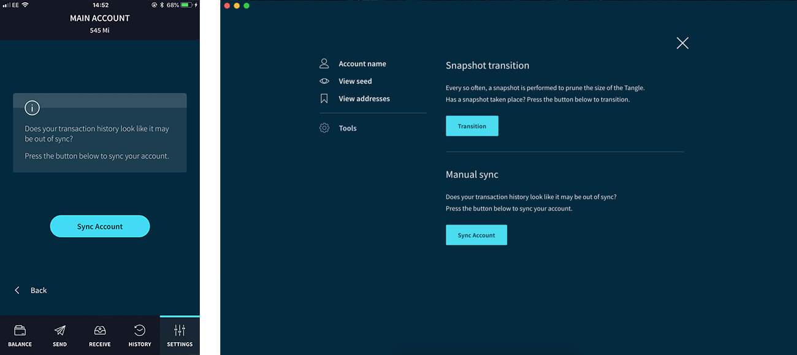

# トラブルシューティング
<!-- # Troubleshooting -->

**このリファレンスガイドを使用して、トリニティに関連する問題を解決してください。**
<!-- **Use this reference guide to resolve issues related to Trinity.** -->

問題の解決策が見つからない場合は、[IOTA StackExchange](https://iota.stackexchange.com/)で検索してください。
<!-- If you can't find the solution to your issue, search the [IOTA StackExchange](https://iota.stackexchange.com/). -->

## 不正確な残高
<!-- ## Incorrect balance -->

トリニティがノードに接続できない場合は、ネットワーク上の古いトランザクションの情報が表示されるかもしれません。この情報は、トリニティに誤った残高を表示させる可能性があります。
<!-- If Trinity can't connect to an node, it may have an outdated view of transactions on the network. This view can cause Trinity to display an incorrect balance. -->

この問題を解決するために、トリニティは生成されたアドレスのリストを保持します。そのためこのリストを使って手動で再同期することができます。
<!-- To fix this problem, Trinity keeps a list of generated addresses so it can be manually re-synchronized. -->

残高が間違っていると思われる（そして[グローバルスナップショット](../how-to-guides/perform-a-snapshot-transition.md)が発生していない）場合は、**設定** > **アカウント** > **アカウント設定** > **ツール** > **アカウントを同期**を選択して手動で同期できます。
<!-- If you think your balance is wrong (and a [global snapshot](../how-to-guides/perform-a-snapshot-transition.md) hasn't occurred), you can manually synchronize it by going to **Settings** > **Account** > **Account management** > **Tools** > **Sync account**. -->

## ペンディングトランザクション
<!-- ## Pending transaction -->

トランザクションを送信すると、確定されるまでペンディング状態になります。
<!-- When you send a transaction, it has a pending status until it's confirmed. -->

トランザクションが長時間ペンディングしている場合は、[自動促進設定](../how-to-guides/auto-promote.md)が**有効**に設定されていることを確認してください。
<!-- If a transaction is pending for a long time, make sure that the [Auto-promotion setting](../how-to-guides/auto-promote.md) is set to **Enabled**. -->

:::info:
自動促進は、モバイル端末では、トリニティが前面に表示されている場合にのみ利用できます。
:::
<!-- :::info: -->
<!-- Auto-promotion is available on mobile devices only when Trinity is in the foreground. -->
<!-- ::: -->

## トランザクションを送信できません
<!-- ## Unable to send a transaction -->

以下のいずれかの理由により、トリニティはトランザクションを送信するのを阻止することがあります。
<!-- Trinity may stop you from sending a transaction for any of the following reasons: -->

- セキュリティ上の理由から、IOTAアドレスからはIOTAトークンを一度だけしか取り出してはいけません。すでにIOTAトークンが取り出されたアドレスに資金がある場合、トリニティはあなたの資金を保護するためにそのアドレスからの取り出しを中止します。
<!-- - For security reasons IOTA addresses should be withdrawn from only once. If you have funds on an address that has already been withdrawn from, Trinity stops you withdrawing from that address to protect your funds. -->
- 送信先アドレスが以前に取り出された状態である場合、トリニティは資金を保護するためにそのアドレスに送信するのを防ぎます。この場合は、受信者に新しいアドレスを尋ねてください。
<!-- - If the address you are sending to has been withdrawn from before, Trinity will prevent you sending to that address to protect the funds. In this case, ask your recipient for a new address. -->
- 複数のトランザクションを作る場合は、最初のトランザクションが確定されるのを待ってから、別のトランザクションを作る必要があります。
<!-- - If you are making multiple transactions, you may need to wait for your first transaction to be confirmed before making another transaction -->

さらなる支援が必要な場合は、公式のIOTA [Discord](https://discord.iota.org)の#helpチャンネルでIOTA財団のメンバーに連絡を取ってください。
<!-- Please get in touch with us on the #help channel in the official IOTA Discord for further help. -->

## デバイスを紛失した
<!-- ## Lost access to a device -->

心配しないでください。あなたのパスワードなしでは誰もあなたのシードまたは残高にアクセスすることはできません。他のデバイスにトリニティをインストールし、セットアップ中にシードバックアップを入力することで、資金にアクセスすることができます。
<!-- Don’t worry, nobody can access your seed or balance without your password. You can access your funds by installing Trinity on another device and entering your seed backup during the setup. -->

:::info:
デバイスを紛失した場合の保護を強化するために、新しいシードを作成して、そのシードのアドレスに紛失したシードの資金を転送してください。
:::
<!-- :::info: -->
<!-- For extra protection in the case of a lost device, please create a new seed and transfer your funds to an address from that seed. -->
<!-- ::: -->
